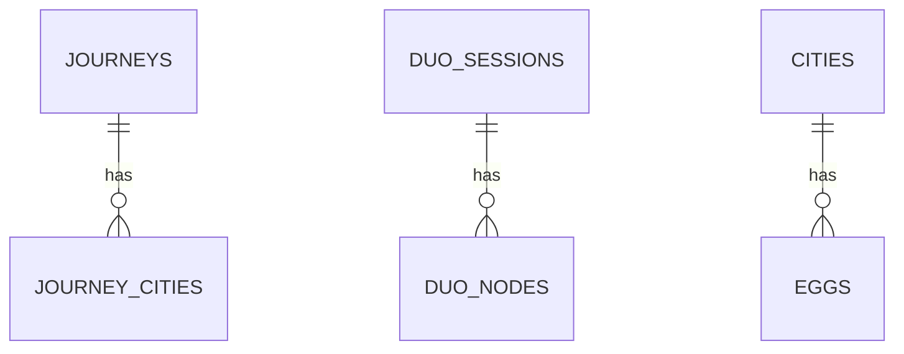

## 1. 架构设计

### 1.1 整体架构（MVP）

```mermaid
flowchart TD
    subgraph "前端"
        A[Vue 3 应用]
        B[地图渲染 ECharts]
        C[Canvas 动画]
        F[html2canvas 图片导出]
    end
    
    subgraph "后端"
        G[Express.js API]
        R1[express-rate-limit]
    end
    
    subgraph "数据库"
        H[SQLite - better-sqlite3]
    end
    
    subgraph "外部服务"
        I[地图逆地理编码 API - 城市搜索/坐标转换]
    end
    
    A --&gt; B
    A --&gt; C
    A --&gt; F
    A --&gt; G
    G --&gt; R1
    G --&gt; H
    A -.-&gt; I
```

### 1.2 V2.0 扩展能力（不在 MVP 范围内）

| 能力 | 说明 | 延后原因 |
|------|------|----------|
| MediaRecorder 视频导出 | Canvas 录制 + WebM 输出 | 移动端兼容性差，合成复杂度高 |
| exif-js 照片解析 | 读取 EXIF GPS 坐标 | 技术链条过长，隐私需法务确认 |
| FFmpeg 转码服务 | WebM→MP4 服务端转码 | 需额外服务部署 |
| MySQL 迁移 | SQLite→MySQL | 数据量增长后再迁移 |

## 2. 技术说明

- **前端框架**: Vue 3 + TypeScript + Vite
- **UI 框架**: Tailwind CSS
- **地图渲染**: ECharts + GeoJSON 地图数据（中国地图 + 世界地图）
- **状态管理**: Pinia
- **后端服务**: Express.js (Node.js)
- **数据库**: SQLite（better-sqlite3，同步操作，无需连接池）→ V2.0 可选迁移 MySQL
- **限流**: express-rate-limit
- **用户标识**: UUID（localStorage），无登录体系
- **构建工具**: Vite
- **部署**: Docker Compose（Nginx + Node.js）

### 2.1 为什么 MVP 选 SQLite 而非 MySQL

| 维度 | SQLite | MySQL |
|------|--------|-------|
| 部署复杂度 | 零配置，一个文件 | 需独立进程/容器 |
| MVP 数据量 | 日均数百条，完全够用 | 过度设计 |
| 备份 | 复制 .db 文件即可 | 需 mysqldump |
| 迁移至 MySQL | better-sqlite3 与 mysql2 API 差异小，迁移成本低 | — |
| 并发写入 | 单写锁，但 MVP 写入量低，不是瓶颈 | 高并发友好 |

## 3. 路由定义

| 路由 | 页面组件 | 用途 |
|------|---------|------|
| / | Home | 首页，包含三个模块的标签切换 |
| /personal | PersonalJourney | 个人足迹模块 |
| /dual | DualMap | 双人地图模块 |
| /anydoor | AnyDoor | 任意门模块 |

## 4. API 定义

### 4.1 个人足迹相关

| 接口 | 方法 | 功能 |
|------|------|------|
| /api/journeys | POST | 创建新旅程 |
| /api/journeys | GET | 获取用户所有旅程列表 |
| /api/journeys/:id | GET | 获取单条旅程详情（城市列表） |
| /api/journeys/:id/cities | POST | 向旅程添加城市节点 |
| /api/journeys/:id/cities | PUT | 更新旅程城市列表（编辑模式下整体更新） |

### 4.2 双人地图相关

| 接口 | 方法 | 功能 |
|------|------|------|
| /api/duo/create | POST | 创建双人地图，返回邀请码 |
| /api/duo/:code/join | POST | 第二人加入，提交节点数据 |
| /api/duo/:code | GET | 获取双人地图完整数据（两人节点+相遇点） |

### 4.3 任意门相关

| 接口 | 方法 | 功能 |
|------|------|------|
| /api/eggs/:city | GET | 随机获取指定城市N条彩蛋 |
| /api/eggs | POST | 提交一条新彩蛋 |
| /api/cities/egg-count | GET | 获取所有城市彩蛋数量（地图光点展示用） |

### 4.4 公共接口

| 接口 | 方法 | 功能 |
|------|------|------|
| /api/cities/search?q=关键词 | GET | 城市搜索（用户输入城市名时自动补全） |

### 4.5 通用规范

**用户标识**：
- 所有 POST/PUT 请求需在 Header 中携带 `X-User-Id: <UUID>`
- UUID 由前端在首次访问时生成并存入 localStorage
- 后端校验 Header 存在性，不存在则返回 401

**响应格式**：
```typescript
interface ApiResponse<T> {
  code: number;   // 0=成功, 400=参数错误, 401=未授权, 404=不存在, 429=限流, 500=服务器错误
  data?: T;
  message?: string;
}
```

**限流**（express-rate-limit）：
| 接口 | 限制 |
|------|------|
| POST /api/eggs | 每 IP 每分钟 5 次 |
| POST /api/journeys | 每用户每天 10 次 |
| POST /api/duo/create | 每 IP 每小时 3 次 |
| 全局 | 每 IP 100 次/分钟 |

### 4.6 TypeScript 类型定义

```typescript
// 城市数据
interface City {
  id: number;
  cityName: string;
  lat: number;
  lng: number;
  country: string;
  level: string;
}

// 旅程节点
interface JourneyCity {
  id: number;
  journeyId: number;
  cityName: string;
  lat: number;
  lng: number;
  sortOrder: number;
  transport: 'plane' | 'train' | 'car' | 'walk';
  label?: string;
}

// 旅程
interface Journey {
  id: number;
  userId: string;           // UUID，前端 localStorage 生成
  userNickname: string;
  journeyName: string;
  templateType: 'template_life' | 'template_year' | 'custom';  // MVP 仅 3 种
  createdAt: string;
  cities: JourneyCity[];
}

// 双人地图会话
interface DuoSession {
  id: number;
  inviteCode: string;
  userAId: string;          // UUID
  userBId?: string;         // UUID
  userANickname: string;
  userBNickname?: string;
  createdAt: string;
  expiresAt: string;        // 邀请码 7 天有效期
}

// 双人地图节点
interface DuoNode {
  id: number;
  sessionId: number;
  userType: 'A' | 'B';
  cityName: string;
  lat: number;
  lng: number;
  sortOrder: number;
  label?: string;           // 如"出生地""大学"
  meetText?: string;        // 该用户在相遇点留下的文字（≤200字）
}

// 双人地图完整数据（前端展示用）
interface DuoMapData {
  session: DuoSession;
  userANodes: DuoNode[];
  userBNodes: DuoNode[];
  // meetingPoints = userACities ∩ userBCities（cityName 交集），后端计算后返回
  meetingPoints: Array&lt;{
    cityName: string;
    lat: number;
    lng: number;
    textA?: string;         // 用户A的相遇文字
    textB?: string;         // 用户B的相遇文字
  }&gt;;
}

// 彩蛋
interface Egg {
  id: number;
  cityName: string;
  userId: string;           // 提交者 UUID
  nickname: string;
  message: string;          // ≤140 字
  isSeed: boolean;          // 是否为种子彩蛋
  createdAt: string;
}
```

## 5. 数据模型

### 5.1 数据模型 ER 图



### 5.2 SQLite 表结构

> SQLite 不强制外键约束（需 `PRAGMA foreign_keys = ON`），以下通过应用层保证数据一致性。

```sql
-- journeys 表（个人旅程）
CREATE TABLE journeys (
    id INTEGER PRIMARY KEY AUTOINCREMENT,
    user_id TEXT NOT NULL,              -- UUID
    user_nickname TEXT NOT NULL,
    journey_name TEXT NOT NULL,
    template_type TEXT NOT NULL,        -- 'template_life' | 'template_year' | 'custom'
    created_at TEXT DEFAULT (datetime('now'))
);

-- journey_cities 表（旅程城市节点）
CREATE TABLE journey_cities (
    id INTEGER PRIMARY KEY AUTOINCREMENT,
    journey_id INTEGER NOT NULL,
    city_name TEXT NOT NULL,
    lat REAL NOT NULL,
    lng REAL NOT NULL,
    sort_order INTEGER NOT NULL,
    transport TEXT NOT NULL,            -- 'plane' | 'train' | 'car' | 'walk'
    label TEXT,
    FOREIGN KEY (journey_id) REFERENCES journeys(id) ON DELETE CASCADE
);

-- duo_sessions 表（双人地图会话）
CREATE TABLE duo_sessions (
    id INTEGER PRIMARY KEY AUTOINCREMENT,
    invite_code TEXT UNIQUE NOT NULL,
    user_a_id TEXT NOT NULL,
    user_b_id TEXT,
    user_a_nickname TEXT NOT NULL,
    user_b_nickname TEXT,
    created_at TEXT DEFAULT (datetime('now')),
    expires_at TEXT NOT NULL            -- created_at + 7 days
);

-- duo_nodes 表（双人地图节点）
CREATE TABLE duo_nodes (
    id INTEGER PRIMARY KEY AUTOINCREMENT,
    session_id INTEGER NOT NULL,
    user_type TEXT NOT NULL CHECK(user_type IN ('A', 'B')),
    city_name TEXT NOT NULL,
    lat REAL NOT NULL,
    lng REAL NOT NULL,
    sort_order INTEGER NOT NULL,
    label TEXT,
    meet_text TEXT,                     -- ≤200 字，相遇时填写
    FOREIGN KEY (session_id) REFERENCES duo_sessions(id) ON DELETE CASCADE
);

-- eggs 表（任意门彩蛋）
CREATE TABLE eggs (
    id INTEGER PRIMARY KEY AUTOINCREMENT,
    city_name TEXT NOT NULL,
    user_id TEXT NOT NULL,
    nickname TEXT NOT NULL,
    message TEXT NOT NULL,              -- ≤140 字
    is_seed INTEGER DEFAULT 0,
    created_at TEXT DEFAULT (datetime('now'))
);

-- cities 表（城市基础数据，预置数据）
CREATE TABLE cities (
    id INTEGER PRIMARY KEY AUTOINCREMENT,
    city_name TEXT NOT NULL,
    lat REAL NOT NULL,
    lng REAL NOT NULL,
    country TEXT NOT NULL,
    level TEXT NOT NULL                 -- 'province' | 'city' | 'world'
);

-- MVP 索引
CREATE INDEX idx_journey_cities_journey_id ON journey_cities(journey_id);
CREATE INDEX idx_journeys_user_id ON journeys(user_id);
CREATE INDEX idx_duo_nodes_session_id ON duo_nodes(session_id);
CREATE INDEX idx_duo_sessions_invite_code ON duo_sessions(invite_code);
CREATE INDEX idx_eggs_city_name ON eggs(city_name);
CREATE INDEX idx_cities_name ON cities(city_name);
```

### 5.3 预置数据说明

| 数据 | 数量 | 来源 |
|------|------|------|
| cities 表 | ~64 条（中国 34 省会/直辖市 + 世界 30 主要城市） | 预置 SQL 脚本 |
| eggs 表 | 10 条种子彩蛋 | 预置 SQL 脚本，is_seed=1 |
| GeoJSON | 中国地图 + 世界地图 2 个文件 | public/geo/ 目录 |

## 6. 目录结构

```
journey-map/
├── public/
│   └── geo/                    # GeoJSON 地图数据（china.json, world.json）
├── src/                        # 前端代码
│   ├── components/             # 组件
│   │   ├── MapCanvas.vue       # 地图画布（ECharts 封装）
│   │   ├── JourneyEditor.vue   # 旅程编辑器（节点列表+交通方式）
│   │   ├── TemplateSelector.vue # 模板选择器（MVP 2个模板卡片）
│   │   ├── AnimationPlayer.vue # 动画播放器（Canvas 交通动画）
│   │   ├── DualMapCreator.vue  # 双人地图创建（邀请码+路径编辑）
│   │   ├── EggCard.vue         # 彩蛋卡片（查看+提交）
│   │   └── AnyDoor.vue         # 任意门（随机传送动画）
│   ├── composables/            # 组合式函数
│   │   ├── useJourney.ts       # 旅程 CRUD
│   │   ├── useDualMap.ts       # 双人地图
│   │   ├── useEggs.ts          # 彩蛋管理
│   │   └── useMap.ts           # 地图操作
│   ├── pages/                  # 页面
│   │   ├── Home.vue            # 首页
│   │   ├── PersonalJourney.vue # 个人足迹
│   │   ├── DualMap.vue         # 双人地图
│   │   └── AnyDoor.vue         # 任意门
│   ├── data/                   # 数据
│   │   ├── cities.ts           # 城市数据（前端搜索用，与后端 cities 表同步）
│   │   └── templates.ts        # 模板数据（人生轨迹、年度足迹）
│   ├── types/                  # 类型定义
│   │   └── index.ts
│   ├── utils/                  # 工具函数
│   │   ├── uuid.ts             # UUID 生成与 localStorage 管理
│   │   ├── export.ts           # 导出功能（html2canvas）
│   │   ├── animation.ts        # Canvas 动画相关（路径计算、图标移动）
│   │   └── api.ts              # axios/fetch 封装（统一错误处理、Header 注入）
│   ├── App.vue
│   └── main.ts
├── api/                        # 后端代码
│   ├── src/
│   │   ├── routes/             # 路由
│   │   │   ├── journeys.ts
│   │   │   ├── duo.ts
│   │   │   ├── eggs.ts
│   │   │   └── cities.ts
│   │   ├── middleware/         # 中间件
│   │   │   ├── auth.ts         # 校验 X-User-Id Header
│   │   │   └── rateLimit.ts    # express-rate-limit 配置
│   │   ├── db/                 # 数据库
│   │   │   ├── connection.ts   # better-sqlite3 初始化
│   │   │   ├── init.sql        # 建表脚本
│   │   │   └── seed.sql        # 预置数据（64城市 + 10条种子彩蛋）
│   │   └── server.ts           # 服务器入口
│   ├── package.json
│   └── tsconfig.json
├── docker/                     # Docker 部署
│   ├── Dockerfile              # Node.js 后端镜像
│   ├── nginx.conf              # Nginx 反代配置
│   └── docker-compose.yml      # 一键部署
├── .env.example
├── package.json
├── tsconfig.json
├── vite.config.ts
└── tailwind.config.js
```

## 7. 关键技术实现

### 7.1 地图渲染
- 使用 ECharts 的 geo 组件渲染地图
- 加载中国地图和世界地图的 GeoJSON 数据（public/geo/ 目录）
- 自定义标记点样式和路径线样式
- 城市坐标使用 GCJ-02 坐标系（高德地图标准）

### 7.2 微缩交通动画
- 使用 Canvas 绘制交通工具图标（图片或 Emoji 渲染）
- 两城市间路径：使用大圆航线或直线插值计算中间点序列
- `requestAnimationFrame` 驱动动画帧，目标 60fps
- 动画时长：每段 1.5-2s，可通过倍速参数调整

### 7.3 图片导出
- 使用 html2canvas 库截取地图画布 DOM 区域
- 在 Canvas 上叠加信息栏（旅程名称、总里程、城市数、日期）
- 导出为 PNG，触发浏览器下载
- 移动端注意 html2canvas 对大 DOM 的渲染性能，建议分块渲染

### 7.4 相遇点计算（双人地图核心算法）
```
// 后端实现伪代码
function calculateMeetingPoints(userANodes: DuoNode[], userBNodes: DuoNode[]) {
  const citySetA = new Set(userANodes.map(n => n.cityName));
  return userBNodes
    .filter(n => citySetA.has(n.cityName))
    .map(n => ({
      cityName: n.cityName,
      lat: n.lat,
      lng: n.lng,
      textA: userANodes.find(a => a.cityName === n.cityName)?.meetText,
      textB: n.meetText,
    }));
}
```
- MVP 仅按城市名（cityName）做交集，不涉及时间维度
- 前端调用 `/api/duo/:code` 时后端计算并返回 meetingPoints

---

## 8. 部署架构

### 8.1 Docker Compose 部署

```yaml
# docker/docker-compose.yml
version: '3.8'
services:
  app:
    build:
      context: ../api
      dockerfile: ../docker/Dockerfile
    volumes:
      - ./data:/app/data        # SQLite 数据文件持久化
    environment:
      - PORT=3000
      - DB_PATH=/app/data/journey.db
    restart: unless-stopped

  nginx:
    image: nginx:alpine
    ports:
      - "80:80"
      - "443:443"
    volumes:
      - ./nginx.conf:/etc/nginx/conf.d/default.conf
      - ../dist:/usr/share/nginx/html   # 前端构建产物
      - ./ssl:/etc/nginx/ssl            # HTTPS 证书
    depends_on:
      - app
    restart: unless-stopped
```

### 8.2 环境变量

```bash
# .env.example
PORT=3000
DB_PATH=./data/journey.db
CORS_ORIGIN=https://your-domain.com
AMAP_API_KEY=your_amap_key        # 高德地图 API Key（城市搜索）
```

---

## 9. 安全设计

| 维度 | MVP 方案 | 说明 |
|------|----------|------|
| 用户标识 | UUID + localStorage | 不收集手机号/邮箱，符合最小化原则 |
| API 鉴权 | X-User-Id Header 校验 | 无敏感操作，仅做基础身份关联 |
| 输入校验 | 后端对所有输入做长度/格式校验 | 防 XSS：昵称≤50字，彩蛋≤140字，城市名白名单校验 |
| SQL 注入 | better-sqlite3 参数化查询 | 不使用字符串拼接 SQL |
| XSS | Vue 默认转义 + DOMPurify 清洗用户内容 | 彩蛋文字和昵称渲染前清洗 |
| 限流 | express-rate-limit | 按接口差异化配置 |
| HTTPS | Nginx + Let's Encrypt | 全站 HTTPS |

> 注意：本项目不收集用户手机号、邮箱、密码等敏感信息，数据安全风险较低。唯一需要关注的是彩蛋内容审核（V2.0 考虑接入内容安全 API）。
