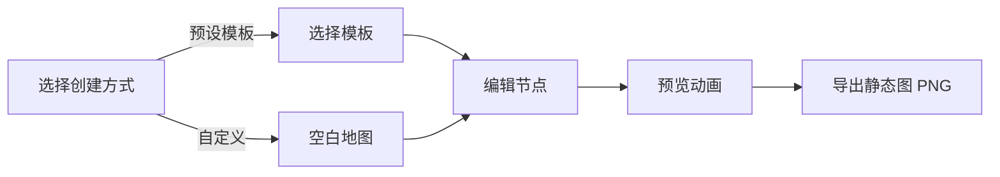

# 「旅程地图」产品需求文档

版本：V1.1
日期：2026年5月26日
用途：VibeCoding参赛投稿 + 产品落地开发

---

## 目录
0. MVP 版本范围划定
1. 项目概述
2. 功能模块详述
   - 模块一：个人足迹
   - 模块二：双人地图
   - 模块三：任意门
3. 页面结构与导航设计
4. 核心指标与成功标准
5. 部署与运维
6. 分期规划

---

## 0. MVP 版本范围划定

三个模块完整实现的范围过大，一个参赛周期内难以高质量交付。以下明确 MVP（V1.0）与 V2.0 的边界：

### 0.1 MVP 必须交付（V1.0）

| 模块 | MVP 范围 | 降级/延后 |
|------|----------|-----------|
| 个人足迹 | 预设模板（2个：人生轨迹 + 年度足迹）+ 自定义旅程；静态图导出（PNG） | 照片导入 → V2.0；视频导出 → V2.0；模板 5→2 |
| 双人地图 | 完整双人路径展示 + 城市级相遇点识别 + 静态图导出 | 时空重合点（需时间维度）→ V2.0；视频导出 → V2.0 |
| 任意门 | 随机传送 + 查看/提交彩蛋 + 城市光点密度图 | 手动选择城市 → MVP 中仅保留搜索框输入城市名；种子彩蛋 10 条 |

### 0.2 V2.0 延后内容

- 照片 EXIF 导入（技术复杂度高，隐私合规需审查）
- 视频动画导出（MediaRecorder 移动端兼容性差，合成复杂度高）
- 剩余 3 个模板（毕业散落、追光地图、难忘旅行）
- 时空重合点检测（需要时间维度数据）
- 手动在地图上点选城市（MVP 用搜索框替代）

### 0.3 为什么要砍这些

- **照片导入**：EXIF 解析 + WGS84→GCJ-02 坐标转换 + 逆地理编码 + 聚类去重，链条太长。且「纯本地处理」的隐私声明需要法务确认，不适合参赛阶段仓促上线。
- **视频导出**：MediaRecorder 在移动端 Safari 支持有限，输出格式为 WebM 而非 MP4，Canvas+Web Audio 合成 BGm 的实现复杂度远超预期。静态图导出（html2canvas）已能满足大部分分享需求。
- **5 个模板减到 2 个**：模板本质是预设数据，2 个足以验证模板机制，其余 3 个可在 V2 用配置化方式追加。

---

## 1. 项目概述

### 1.1 项目名称
旅程地图

### 1.2 一句话定义
一个基于地图画布的个人旅程记录与轻社交工具。用户可以绘制个人年度足迹、与重要的人共创相遇路径，以及通过「任意门」发现陌生人留在世界各地的文字彩蛋。

### 1.3 产品定位
以「地图」为核心载体，将个人叙事、亲密关系和陌生人社交三层情感需求，融合为一个有温度的轻量级Web应用。

### 1.4 三个核心功能模块
| 模块 | 功能名 | 核心体验 | 社交半径 |
|------|--------|----------|----------|
| 模块一 | 个人足迹 | 通过预设模板、自定义编辑或相册导入，记录与回顾个人旅程，生成带有微缩交通动画的可视化年度轨迹，支持导出图片与视频 | 自我 |
| 模块二 | 双人地图 | 两人各自在地图上标记成长路径，系统识别并高亮交汇点，生成属于两个人的相遇故事地图 | 亲密关系 |
| 模块三 | 任意门 | 随机或手动选择抵达世界任意城市，发现陌生人留下的文字彩蛋，也可以留下自己的故事，体验异步社交的惊喜 | 陌生人 |

### 1.5 目标用户
- 有旅行经历、喜欢可视化回顾的年轻人
- 情侣、闺蜜、家人等想共同记录关系轨迹的人群
- 对陌生人故事有好奇心，喜欢收集与留下数字足迹的用户
- 想通过照片快速生成旅行路线的轻量用户

### 1.6 产品目标
- 产品侧：三个模块均可正常运行，稳定承载日均数百条彩蛋查询与提交
- 内容侧：产出至少3条系列短视频/图文，呈现从个人→双人→陌生人的完整叙事线

---

## 2. 功能模块详述

---

### 模块一：个人足迹

#### 2.1.1 功能概述
用户创建一条旅程，在地图上按时间顺序标记去过的城市，选择交通工具，系统自动生成带有微缩交通动画的旅程预览，并支持导出为静态足迹图和动态旅程视频。

#### 2.1.2 旅程创建方式
提供三种创建入口，用户任选其一：

##### 方式一：预设模板
设计理念：模板提供骨架，用户只需填空，降低从零到一的阻力。每个模板附带预设城市节点和引导问题，用户可在预设基础上增删改。

模板列表（MVP 保留 2 个，其余 V2.0）:

| 序号 | 模板名称 | 预设节点 | 引导问题 | 适用人群 | 版本 |
|------|----------|----------|----------|----------|------|
| 1 | 我的人生轨迹 | 出生地→大学城市→第一份工作城市→现在所在城市 | 「你在哪里出生？」「在哪里度过了大学时光？」「第一份工作把你带到了哪个城市？」「现在的你，停靠在哪里？」 | 所有人 | MVP |
| 2 | 2026年度足迹 | 1月→4月→7月→10月→12月 | 「今年1月你在哪里？」「春天去了哪座城市？」「夏天有什么出行？」「秋天呢？」「年末你停在哪？」 | 有多次出行经历的人，年末复盘场景 | MVP |
| 3 | 难忘的一次旅行 | 出发城市→途经城市→目的地→返程城市 | 「从哪里出发？」「途经了哪里？」「目的地是哪里？」「最后回到了哪里？」 | 记录单次旅行路线 | V2.0 |
| 4 | 毕业散落地图 | 学校所在城市→朋友去的城市A→城市B→城市C… | 「我们在哪个城市一起度过了大学？」「毕业之后，Ta去了哪里？」「另一个朋友去了哪？」 | 毕业季场景 | V2.0 |
| 5 | 追光地图 | 演唱会/见面会城市A→城市B→打卡地C… | 「第一次见Ta在哪里？」「为了Ta去了哪些城市？」「最难忘的一场在哪里？」 | 粉丝群体 | V2.0 |

模板使用流程：
1. 用户点击某个模板卡片，进入编辑页面
2. 地图上已预设好节点位置，引导问题显示在侧边栏
3. 用户逐个点击节点，输入自己的城市名（可搜索，自动匹配坐标）
4. 每段城市间选择交通方式（飞机/高铁/自驾/步行）
5. 可自由增加节点（「添加一站」）或删除预设节点
6. 填写完成后 → 进入预览动画 → 导出

##### 方式二：自定义旅程
| 项目 | 说明 |
|------|------|
| 入口名称 | 「自定义旅程」或「从零开始」 |
| 初始状态 | 空白地图画布，无预设节点 |
| 操作流程 | 用户自由点击地图添加城市 → 逐个选择交通方式 → 调整顺序 → 预览导出 |
| 适用人群 | 模板不满足需求、想完全自由发挥的用户 |

##### 方式三：照片导入【V2.0 延后】

> **延后原因**：EXIF 解析 + 坐标转换（WGS84→GCJ-02）+ 逆地理编码 + 聚类去重的技术链条过长；「纯本地处理」的隐私声明需法务确认。MVP 阶段不实现，以下保留设计供 V2.0 参考。

功能描述：用户批量选择手机相册中的照片，系统自动读取照片EXIF信息中的GPS经纬度坐标和拍摄时间，按时间顺序自动生成一条基于真实拍摄位置的旅程路线。

设计理念：
- 零手动输入：用户无需回忆去过哪里、手动搜索地名，照片就是最好的旅行日记
- 完全本地化：所有照片解析在用户设备本地完成，照片不会上传到任何服务器，保护隐私
- 与模板/自定义互补：最「懒人」的创建方式

技术原理：
| 环节 | 说明 |
|------|------|
| 照片选择 | 使用系统相册选择器，支持多选 |
| EXIF解析 | 在前端使用 exif-js 等轻量JS库读取照片二进制数据，提取GPS标签 |
| 坐标获取 | 从EXIF中读取 GPSLatitude、GPSLongitude 等字段，转换为十进制度数 |
| 坐标转换 | 照片为WGS84坐标系，若使用高德/百度地图需在前端做坐标偏移转换（如GCJ-02） |
| 地名反查 | 根据经纬度调用地图API（如高德逆地理编码），将坐标转换为城市名 |
| 时间排序 | 读取EXIF中的 DateTimeOriginal 拍摄时间，按时间顺序排列节点 |
| 聚类去重 | 同一城市、相近时间段内的多张照片合并为一个节点 |

用户操作流程：
1. 用户在创建旅程页面点击「从相册导入」
2. 系统弹出引导提示：「请选择您旅行中拍摄的照片。我们会读取照片的拍摄地点和时间，自动生成您的旅程路线。所有解析都在您的设备本地完成，照片不会上传。」
3. 用户从相册批量选择照片（建议上限50张，避免解析过久）
4. 系统显示解析进度条（读取EXIF → 提取坐标 → 匹配城市名）
5. 解析完成后进入「确认与调整」页面：
   - 地图预览：自动生成的路线在地图上展示
   - 节点列表：每个节点显示城市名、拍摄日期、照片缩略图
   - 手动调整：
     - 合并相邻相同城市节点
     - 删除不想保留的节点
     - 手动插入遗漏的城市
     - 拖拽调整顺序
   - 交通方式选择：每段城市间用户需手动选择交通工具（照片无法自动识别）
6. 用户点击「生成旅程」→ 进入预览动画 → 导出

边界情况处理：
| 场景 | 处理方式 |
|------|----------|
| 照片无GPS信息 | 跳过该照片，解析完成后提示「X张照片无位置信息，已自动跳过」 |
| 照片无拍摄时间 | 使用文件修改时间作为备选，或将该照片排在最后 |
| 所有照片都在同一城市 | 提示「您的照片都拍摄于同一城市，无法生成跨城路线，建议手动添加其他城市节点」 |
| 用户只选了1张照片 | 提示「至少需要2个不同城市的照片才能生成路线哦」 |
| 照片数量超过50张 | 提示分批导入 |
| 部分城市名无法识别 | 标记为「未知地点」，允许用户手动输入城市名 |

隐私与安全性说明：
| 维度 | 说明 |
|------|------|
| 数据上传 | 照片不会上传到服务器，所有EXIF解析在浏览器本地完成 |
| 坐标存储 | 提取后的城市名和经纬度存储在后端数据库，不关联原始照片 |
| 照片文件 | 前端仅临时读取二进制数据，不缓存、不存储照片文件本身 |
| 前端提示 | 界面需明确告知用户「照片不会上传，解析在本地完成」 |
| 地图API | 逆地理编码请求将经纬度发送给地图服务商，建议对坐标做精度截断（保留小数点后3位） |

三种创建方式总结：
| 方式 | 适合场景 | 用户输入量 | 路线数据来源 | 版本 |
|------|----------|------------|--------------|------|
| 预设模板 | 想快速开始，按模板填空 | 低 | 预设节点 + 用户填写城市名 | MVP |
| 自定义旅程 | 想完全自由发挥 | 中 | 用户手动添加城市和交通方式 | MVP |
| 照片导入 | 有现成旅行照片，想自动生成 | 极低 | 照片EXIF自动提取 | V2.0 |

MVP 两种方式最终进入同一个预览和导出流程，体验一致。

#### 2.1.3 旅程编辑页面
无论是模板、自定义还是照片导入，最终都进入同一个编辑页面：
- 地图画布：居中显示，支持缩放和拖拽
- 节点列表：侧边栏显示城市卡片列表，每张卡片包含：
  - 城市名
  - 序号
  - 交通方式选择器（与下一城市的连接方式）
  - 删除按钮
- 操作按钮：
  - 「添加一站」：在地图上点击添加新城市
  - 「预览动画」：进入动画预览模式
  - 「保存旅程」：保存至个人旅程列表

#### 2.1.4 动画方案：微缩交通模型
动画不使用抽象粒子光效，而是采用具象的交通工具图标 + 路径绘制的叙事动画。

核心规则：
1. 从旅程起点城市坐标开始，画布为当前地图视野
2. 按城市顺序，逐个城市间执行以下动画：
   - 从当前城市向下一城市绘制一条实线路径
   - 路径颜色与交通方式关联（蓝色=飞机，绿色=高铁，灰色=自驾，浅色=步行）
   - 路径绘制同时，对应交通工具图标沿路径移动：

| 交通方式 | 图标 | 动画表现 |
|----------|------|----------|
| 飞机 | ✈️ | 小飞机图标，从起点轻微上扬弧线飞出，沿路径飞行，抵达终点时轻微下降 |
| 高铁 | 🚄 | 小火车图标，沿路径轨道线行驶，可带轻微震动感 |
| 自驾 | 🚗 | 小汽车图标，沿路径行驶，可带微小的方向转向 |
| 步行 | 🚶 | 小人图标，缓慢移动，适用于短距离 |

3. 当前段动画完成后，抵达城市节点点亮（出现城市名标签和序号）
4. 所有城市段依次播放，直至终点

动画时长：
- 每段城市间动画：1.5-2秒
- 总时长 = 城市段数 × 约2秒
- 导出时提供倍速选项（1x / 1.5x / 2x）

#### 2.1.5 导出功能
##### A. 静态足迹图导出
| 项目 | 说明 |
|------|------|
| 导出格式 | PNG（推荐，保证清晰度） |
| 画面内容 | 完整地图画布 + 所有路径连线 + 所有城市标记点 |
| 附加信息栏 | 右下角或底部显示：旅程名称、总里程、城市数量、交通工具占比小图标、生成日期 |
| 配色方案 | 提供2-3套可选：极简白底、暗夜地图、复古手绘 |
| 实现方式 | 前端用 html2canvas 截图地图画布区域，触发浏览器下载 |

##### B. 旅程动画视频导出【V2.0 延后】

> **延后原因**：
> - MediaRecorder API 在移动端 Safari 支持有限（iOS 需 14.5+，且仅支持 WebM 而非 MP4）
> - Canvas 录制 + Web Audio API 合成 BGM 的实现复杂度远超预期
> - 1080p 视频在前端录制耗时长且可能因内存不足崩溃
> - 静态图导出（PNG）已能满足 MVP 的分享需求
>
> 以下设计保留供 V2.0 参考。

| 项目 | 说明 |
|------|------|
| 导出格式 | WebM（MediaRecorder 原生输出），服务端转码为 MP4 |
| 画面内容 | 从起点开始，按「微缩交通模型动画」逻辑完整播放全旅程 |
| 背景音乐 | 提供2-3首免版权BGM可选 |
| 字幕/标题 | 视频开头显示旅程名称，每个城市到达时短暂显示城市名 |
| 倍速选项 | 1x / 1.5x / 2x |
| 分辨率 | 720×1280（竖屏）或 1280×720（横屏），降级以保证稳定性 |
| 移动端策略 | 移动端提示用户使用桌面端导出，或提供 GIF 替代方案（720p，15fps，≤15秒） |

视频导出 V2.0 推荐路径：
- 纯前端方案（WebM 输出）：Canvas + MediaRecorder + Web Audio API，适合桌面端 Chrome/Edge
- 混合方案（MP4 输出）：前端录制 Canvas 帧数据 → 发送到服务端用 FFmpeg 合成 MP4 → 返回下载链接。此方案更可控但需要服务端算力。
- 移动端降级：生成 GIF 动图（gif.js 或现代 gif 编码库），限制 15 秒、15fps、720p

---

### 模块二：双人地图

#### 2.2.1 功能描述
两个人各自在地图上标记自己的成长路径（出生地、大学、工作城市等），两条路径独立绘制，最终在一个或多个城市交汇，系统识别并点亮交汇点，生成属于两个人的相遇故事地图。

#### 2.2.2 用户操作流程
1. 用户A创建双人地图
   - 点击「双人地图」标签进入
   - 输入自己的昵称
   - 系统生成一个唯一的6位邀请码或分享链接
   - 用户A开始在地图上添加自己的人生关键节点城市：
     - 按时间顺序标记（出生地→大学→第一份工作→现在…）
     - 每个节点可添加标签（「出生」「大学」「第一份工作」等）
   - 提交后，等待用户B加入
2. 用户B通过邀请加入
   - 用户B点击邀请链接或输入邀请码
   - 输入自己的昵称
   - 同样在地图上标记自己的人生关键节点
   - 提交后，系统自动计算两人路径的交汇点
#### 2.2.3 相遇点判定规则

> 这是双人地图的核心逻辑，需在前后端一致实现。

**城市级相遇（MVP 实现）**：
- 定义：用户 A 和用户 B 的节点列表中，存在 cityName 相同的城市
- 判定逻辑：`userACities ∩ userBCities`（取城市名交集）
- 示例：A 标记了「北京→上海→成都」，B 标记了「成都→深圳」→ 相遇点 = 「成都」
- 多个相遇点时，按 A 的路径时间顺序展示

**时空重合点（V2.0 延后）**：
- 需要节点携带时间维度（年份或日期），判定同一城市 + 时间段重叠
- MVP 不实现，数据模型中预留 `label` 字段供未来扩展

**相遇文字**：
- 每个相遇点允许双方各自填写一段文字（≤200 字）
- A 填写的文字对 B 可见（在 B 查看双人地图时展示），反之亦然
- 文字存储在后端，读取时不做自动合并——双方内容独立展示
4. 交互与导出
   - 点击交汇点可添加一段文字描述（如「2023年9月，我们在成都遇见」）
   - 支持一键切换单人视角/双人合并视角
   - 支持导出为静态图或动画视频

#### 2.2.4 双人动画方案
双人地图的动画与个人足迹采用相同的「微缩交通模型」逻辑，但有以下差异：
- 双路径并行：两条路径同时从各自起点开始绘制
- 颜色区分：路径A（如蓝色）、路径B（如粉色）
- 图标区分：两个不同的交通工具图标同时移动
- 相遇时刻：
  - 两条路径最终汇聚到相遇城市
  - 汇聚瞬间，地图以相遇点为中心出现扩散光效
  - 弹出一个心形或星形标记，显示双方在此的留言文字
  - 若有多个相遇点，按时间顺序依次展示

#### 2.2.5 分享与隐私
- 仅拥有邀请码/链接的用户可加入该双人地图
- 双人地图默认不公开，仅创建者和受邀者可见
- 导出后的图片/视频由用户自行决定是否分享到社交平台

---

### 模块三：任意门

#### 2.3.1 功能描述
用户点击「打开任意门」，随机传送到一个城市（或手动选择），可以看到该城市中其他用户留下的文字彩蛋，也可以自己留下一条，存入城市彩蛋库。

#### 2.3.2 用户操作流程
1. 用户切换到「任意门」标签，看到一扇门的动画（简易CSS动画即可）
2. 用户选择传送方式：
   - 随机传送：点击「开门」，系统从城市池中随机选一个城市
   - 手动选择：用户在大地图上直接点击任意城市
3. 画面定位到目标城市，弹出彩蛋卡片：
   - 随机展示该城市的1-3条彩蛋
   - 卡片显示：留言内容、留言者昵称、时间
   - 若该城市尚无彩蛋，显示：「这里还没有人留下足迹，来做第一个吧」
4. 用户读完彩蛋后，可选择「我也留一个」：
   - 输入文字（限制140字）
   - 输入昵称（默认沿用，可临时修改）
   - 点击提交，存入该城市的彩蛋库
5. 系统提示：「你的彩蛋已留在『巴黎』，等待下一位旅行者发现」

#### 2.3.3 彩蛋库机制
| 维度 | 说明 |
|------|------|
| 初始种子 | 上线前预置10条高质量种子彩蛋，分布在5-8个热门城市（北京、上海、成都、东京、巴黎、纽约等），确保早期体验不空洞 |
| 真实沉淀 | 所有后续彩蛋由真实用户使用产生 |
| 更新策略 | 每个城市独立存储彩蛋库，新彩蛋追加，旧彩蛋永久保留 |
| 展示规则 | 每次随机抽取1-3条，确保彩蛋多的城市不会只显示最新几条 |
| 城市覆盖 | MVP：中国省会+直辖市 34 个 + 世界主要城市 30 个；V2.0 扩展至中国 300+ 城市 + 世界 200+ 城市 |

#### 2.3.4 页面视觉
- 地图背景上，有彩蛋的城市显示为小光点，光点大小代表该城市彩蛋数量
- 用户抵达某个城市时，该城市光点脉动一下
- 彩蛋卡片弹出时有轻微飘落动效

#### 2.3.5 投稿叙事价值
「任意门」是三层情感半径的最终延伸——从自我到亲密关系到陌生人。它在投稿中最具「传播力」的价值在于：
- 惊喜感：随机抵达、随机发现
- 参与感：用户可以真的扫码/点链接来玩，留下真实彩蛋
- 故事性：后续可拍「48小时后，陌生人的彩蛋淹没了我的地图」等内容

---

## 3. 页面结构与导航设计

### 3.1 首页布局
- 中心：世界地图（默认中国视野）画布，可缩放拖拽
- 顶部：切换标签栏 —「个人足迹」|「双人地图」|「任意门」
- 底部/侧边栏：当前模块的操作入口

### 3.2 模块切换逻辑
- 三个模块共享同一地图画布，切换时地图位置保持不变
- 切换模块时，地图上的标记和线条随之变化：
  - 个人足迹：展示当前选中旅程的路径
  - 双人地图：展示两人路径与相遇点
  - 任意门：展示城市彩蛋密度光点

### 3.3 地图选型
- 推荐使用 ECharts + 地图JSON（中国地图/世界地图），或 Leaflet.js 加载离线/在线瓦片
- 精确到市一级，国内城市数据约300+，世界主要城市约200+
- 城市坐标经纬度需预置一份基础数据表

---

## 4. 用户界面设计

### 4.1 设计风格
- **主色调**：深蓝（#1e3a5f）作为品牌色，代表旅行与探索；辅以柔和的橙黄（#f5a623）作为点缀色，代表温暖与惊喜
- **辅助色**：天空蓝（#4a90e2）- 飞机路径，草绿（#7ed321）- 高铁路径，暖灰（#9b9b9b）- 自驾路径
- **按钮风格**：圆角矩形（border-radius: 12px），柔和阴影，悬停时有轻微上浮动画
- **字体**：标题使用 Cormorant Garamond，优雅有故事感；正文使用 Inter，清晰易读
- **布局风格**：卡片式布局，中心地图为主，侧边栏提供操作区
- **图标**：使用 Phosphor Icons 线性图标，简洁现代

### 4.2 页面设计概述
| 页面名称 | 模块名称 | UI元素 |
|---------|---------|---------|
| 首页 | 标签导航 | 三个标签水平排列，当前选中标签下划线高亮，平滑过渡动画 |
| 首页 | 地图画布 | 全屏或半屏地图，支持缩放拖拽，深色模式/浅色模式切换 |
| 个人足迹 | 模板选择 | 卡片网格布局，每个模板有预览图、标题、引导语，悬停时轻微放大 |
| 个人足迹 | 编辑页面 | 左侧节点列表卡片，右侧地图，节点拖拽排序，交通方式选择器 |
| 个人足迹 | 动画预览 | 全屏动画，底部控制条（播放/暂停/倍速），右上角导出按钮 |
| 双人地图 | 相遇点 | 心形标记，彩色脉冲动画，点击弹出故事卡片 |
| 任意门 | 彩蛋卡片 | 半透明玻璃态卡片，轻柔飘落动画，渐变背景 |

### 4.3 响应式设计
- 桌面端（&gt;1024px）：左右分栏布局，左侧操作区，右侧地图
- 平板端（768px-1024px）：顶部操作区，下方地图
- 移动端（&lt;768px）：垂直布局，地图全屏，操作区底部悬浮或抽屉式
- 触摸优化：按钮最小高度 44px，交互区域足够大

### 4.4 动画与交互细节
- 页面加载：地图渐显，标签栏依次滑入
- 节点添加：城市标记从地图中心「掉落」到目标位置
- 动画播放：交通工具图标有轻微的上下波动，模拟真实运动
- 彩蛋出现：卡片从屏幕上方飘落，带有轻微的旋转
- 切换标签：地图标记平滑过渡，旧标记淡出，新标记淡入

---

## 5. 核心流程

### 5.1 个人足迹创建流程（MVP）


### 5.2 双人地图创建流程
```mermaid
flowchart LR
    A[用户A创建] --&gt; B[输入昵称]
    B --&gt; C[生成邀请码]
    C --&gt; D[标记用户A路径]
    E[用户B加入] --&gt; F[输入邀请码]
    F --&gt; G[标记用户B路径]
    D --&gt; H[系统计算相遇点]
    G --&gt; H
    H --&gt; I[生成双人地图]
    I --&gt; J[添加相遇故事]
    J --&gt; K[导出分享]
```

### 5.3 任意门使用流程
```mermaid
flowchart LR
    A[打开任意门] --&gt; B[选择传送方式]
    B --&gt;|随机| C[随机选城市]
    B --&gt;|手动| D[点击地图选城市]
    C --&gt; E[查看彩蛋]
    D --&gt; E
    E --&gt; F{是否留彩蛋?}
    F --&gt;|是| G[输入文字]
    F --&gt;|否| H[继续探索]
    G --&gt; I[提交彩蛋]
    I --&gt; H
```

---

## 6. 部署与运维

### 6.1 部署方案

MVP 阶段推荐 **单机 Docker 部署**，兼顾简单和可迁移性：

| 项目 | 方案 |
|------|------|
| 部署方式 | Docker Compose（前端 Nginx + 后端 Node.js + SQLite） |
| 服务器 | 2C4G 云服务器即可承载日均数百次请求 |
| 域名 | 一个域名，Nginx 反代前端静态文件和后端 API |
| HTTPS | Certbot / acme.sh 自动续签 Let's Encrypt 证书 |
| CDN | 前端静态资源（JS/CSS/GeoJSON）可选 CDN 加速，非必需 |

### 6.2 鉴权策略

由于项目定位为轻量 Web 应用，MVP 不引入注册/登录体系，采用以下轻量方案：

- **用户标识**：首次访问时前端生成 UUID，存入 localStorage 作为用户唯一标识
- **API 鉴权**：所有写请求（POST/PUT）携带该 UUID，后端校验其有效性
- **邀请码**：双人地图使用 6 位随机邀请码，服务端存储，有效期 7 天
- **安全边界**：无敏感个人信息，仅存储昵称+城市节点+彩蛋文字

V2.0 可选接入微信扫码登录或手机验证码登录。

### 6.3 限流策略

| 接口 | 限制 | 原因 |
|------|------|------|
| /api/eggs (POST) | 每 IP 每分钟 5 条 | 防灌水 |
| /api/journeys (POST) | 每用户每天 10 条 | 防滥用 |
| /api/duo/create (POST) | 每 IP 每小时 3 个 | 防止批量创建 |
| 全局 | 每 IP 100 次/分钟 | 基础保护 |

后端使用 express-rate-limit 中间件实现。

### 6.4 错误处理

- 所有 API 返回统一格式：`{ code: number, data?: T, message?: string }`
- code=0 表示成功，非 0 表示错误（400 参数错误 / 404 资源不存在 / 429 限流 / 500 服务器错误）
- 前端 axios/fetch 拦截器统一处理错误，toast 提示用户

---

## 7. 分期规划

### V1.0 MVP（参赛提交，2-3 周）

| 模块 | 交付内容 |
|------|----------|
| 个人足迹 | 2 个模板 + 自定义旅程；城市搜索与添加；交通方式选择；Canvas 微缩交通动画预览；静态图 PNG 导出（html2canvas） |
| 双人地图 | 邀请码创建/加入；A/B 双路径标记；城市名交集相遇点计算；双人动画预览；静态图导出 |
| 任意门 | 随机传送 ≥30 个城市；10 条种子彩蛋；查看/提交彩蛋（140 字）；城市光点密度 |
| 基础设施 | Docker Compose 部署；SQLite 数据库；UUID 用户标识；express-rate-limit 限流；GeoJSON 地图数据 |

### V2.0（赛后打磨，+2-3 周）

| 模块 | 交付内容 |
|------|----------|
| 个人足迹 | 照片 EXIF 导入；视频导出（WebM/MP4）；追加 3 个模板；多套配色方案 |
| 双人地图 | 时空重合点检测（时间维度）；视频导出；一键切换单人/双人视角 |
| 任意门 | 城市池扩展至 500+；手动地图点选城市；彩蛋点赞/举报 |
| 基础设施 | 迁移至 MySQL（如数据量增长）；CDN 加速；可选微信登录 |

### V3.0 探索方向（视反馈决定）

- AI 生成旅程文案（接入 LLM API，根据城市节点自动生成旅行叙事）
- 公开旅程广场（用户可选择公开旅程，社区浏览与互动）
- 年度回顾自动生成（基于用户历史旅程数据）

